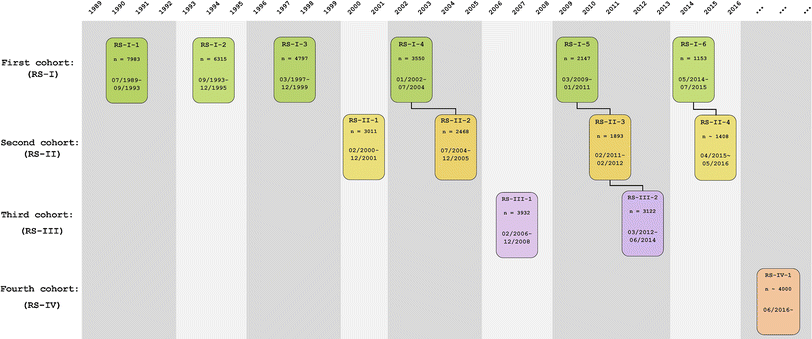

# Introduction {#intro}

## Prerequisites

- Install R and Rstudio IDE

- Install and open the following packages: `tidyverse`, `rio`, `here`.

- Create an R project with a folder for your raw data (We will name this folder `00_raw_data`)

- Data can be accessed from the following:  [link](https://epi-wiki.erasmusmc.nl/wiki/ergowiki/index.php/Ergobasics)

## Rotterdam study data structure

We followed the structure of the visit process to name the cohorts and visits:

```{r, echo = FALSE, out.width = "100%"}

```

In the following structure:

```{r, echo = FALSE}
var1 <- c("RS-I-1", NA, NA)
var2 <- c("RS-I-2", NA, NA)
var3 <- c("RS-I-3", "RS-II-1 (ep)", NA)
var4 <- c("RS-I-4", "RS-II-2", "RS-III-1 (ej)")
var5 <- c("RS-I-5", "RS-II-3", "RS-III-2")
var6 <- c("RS-I-6", "RS-II-4", "RS-III-3")

rs <- cbind(var1, var2, var3, var4, var5, var6)

knitr::kable(rs)
```

We name each variable in the same way over the waves and end with the number that corresponds to the visit.


## Overview of the process to clean a variable

Each small chapter will provide the code to clean each of the variables that are oftenly used as covariates in any data analysis.

Since the name of the variables could have changed in each visit, and data is arranged in different ways, we decided to create a systematic flow of how the cleaning process is one covariate at a time, for all visits, for all cohorts.

The usuals steps will include:

1. Import datasets for all the visits, for all cohorts. 

- Note that we use the `here` package to specify the folder/subfolder and file we want to import. We do this to avoid specifying the directory. This practice helps the reproducibility of the code as mentioned in the following [link](https://www.tidyverse.org/articles/2017/12/workflow-vs-script/)
  
  - We will always include the subfix representing the cohort and visit. For example:
  
```{r, eval = FALSE}
rs1_1 <- read_sav(here::here("00_raw_data", "visits", "Ergo1ResponseDetail_(22-jan-2015)_excerpt.sav"))
rs1_2 <- read_sav(here::here("00_raw_data", "visits", "Ergo2ResponseDetail_(22-jan-2015)_excerpt.sav"))
rs1_3 <- read_sav(here::here("00_raw_data", "visits", "e3_(3)_RESPONS_(22-feb-2016)_excerpt.sav"))
rs1_4 <- read_sav(here::here("00_raw_data", "visits", "e4_(4)_RESPONS_(12-mar-2018)_excerpt.sav"))
rs1_5 <- read_sav(here::here("00_raw_data", "visits", "e5_(5)_RESPONS_(22-jun-2016)_excerpt.sav"))
rs1_6 <- read_sav(here::here("00_raw_data", "visits", "e6_(6)_RESPONS_(10-feb-2017)_EXCERPT.sav"))
rs2_1 <- read_sav(here::here("00_raw_data", "visits", "ep_(1)_RESPONS_(15-jan-2019)_excerpt.sav"))
rs3_1 <- read_sav(here::here("00_raw_data", "visits", "ej_(1)_RESPONS_(04-apr-2016)_excerpt.sav"))
```

2. We will split the datasets that have data for more than one cohort, and name them by their respective cohort - visit. For example:

```{r, eval = FALSE}
# Separate rs1_4 into rs1, rs2

rs1_4 <- rs1_4 %>%
  filter(rs_cohort == 1)

rs2_2 <- rs1_4 %>%
  filter(rs_cohort == 2)

```

3. Merge the data for all visits, by cohort:

```{r, eval = FALSE}
rs1 <- list(rs1_1, rs1_2, rs1_3, rs1_4, rs1_5, rs1_6)

rs1_vis <- reduce(rs1, left_join, by = c("ergoid", "rs_cohort"))
```

4. Select the specific variables from the combined dataset, by cohort and rename for easier comprehension, by cohort:

```{r, eval = FALSE}
rs1_bmi <- rs1_bmi%>%
  select(ergoid, rs_cohort, e1_aahgt, e1_aawgt, e2_229, e2_230, e3_229, e3_230, e4_229, e4_230, e5_229, e5_230,e6_229,e6_230) %>%
  rename(hgt1 = e1_aahgt, hgt2 = e2_229, hgt3 = e3_229, hgt4 = e4_229, hgt5 = e5_229, hgt6 = e6_229,
         wgt1 = e1_aawgt, wgt2 = e2_230, wgt3 = e3_230, wgt4 = e4_230, wgt5 = e5_230, wgt6 = e6_230)
```

5. Bind, if necessary, the cohorts. Since the variable names are consistent through the datasets.

```{r, eval = FALSE}
rs_bmi <- rs1_bmi %>%
  bind_rows(rs2_bmi) %>%
  bind_rows(rs3_bmi)
```

6. Create new variables (Example)

```{r, eval = FALSE}
rs_bmi <- rs_bmi %>%
  mutate(bmi1 = wgt1/((hgt1/100)^2),
         bmi2 = wgt2/((hgt2/100)^2),
         bmi3 = wgt3/((hgt3/100)^2),
         bmi4 = wgt4/((hgt4/100)^2),
         bmi5 = wgt5/((hgt5/100)^2),
         bmi6 = wgt6/((hgt6/100)^2))

#Note that we could have created a function, but the intention of this code is to make adaptable.
```


7. Export the variable to a `clean_data` folder.

`export(bmi, here::here("02_clean_data", "bmi.Rdata"))`

8. Merge variables by `ergoid` for a complete folder